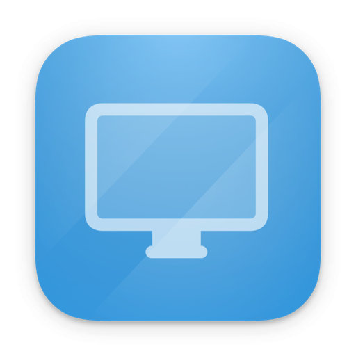
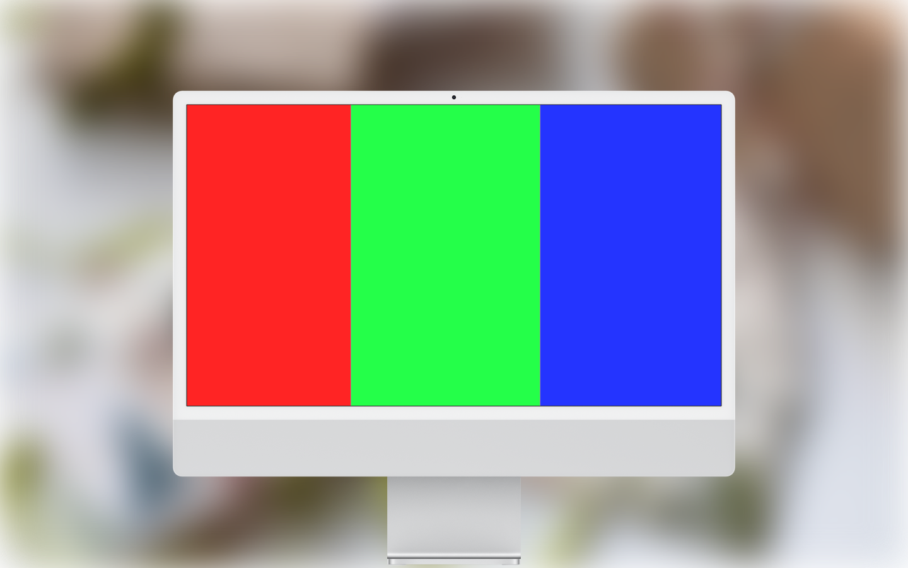
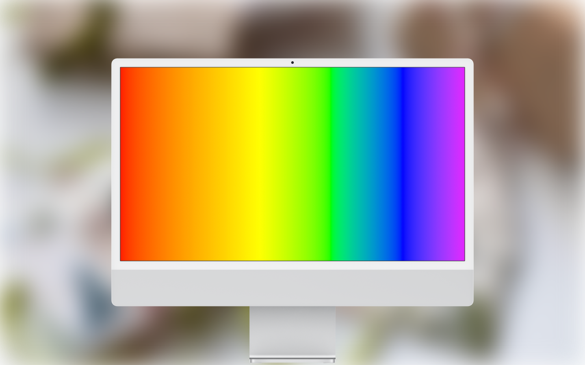
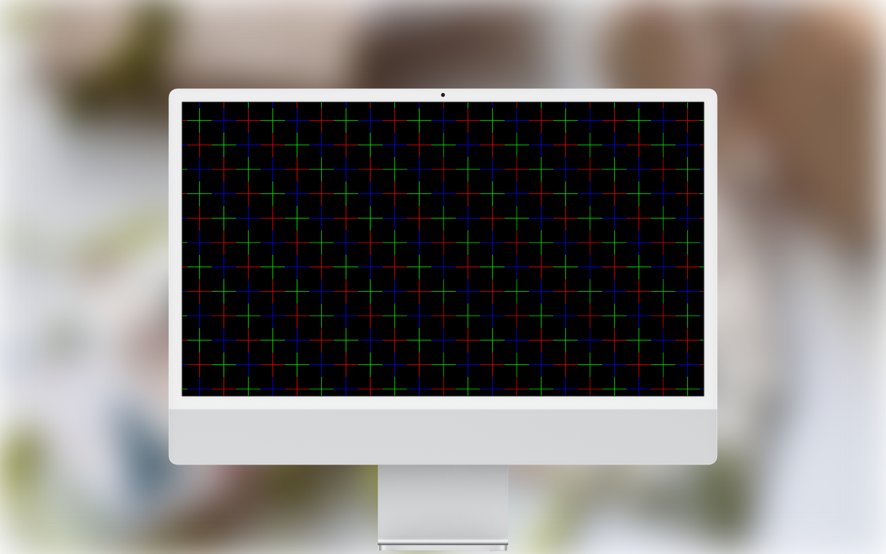
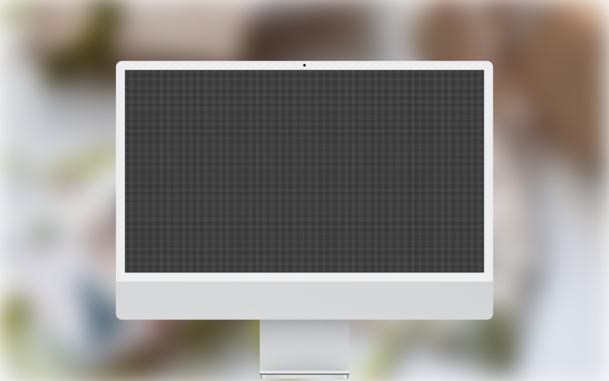

<!--idoc:ignore:start-->
> [!TIP]
> Declaration: This project is not an open-source project. The repository serves as the official website, used to collect issues and user demands. This is done to save costs, because without an official website, the application cannot pass the review.
<!--idoc:ignore:end-->

   
   
  
  <h1>
    Screen Test
  </h1>
  <!--rehype:style=border: 0;-->
  

    <a href="./README.zh.md">简体中文</a> • 
    <a target="_blank" href="https://github.com/jaywcjlove/screen-test/issues/new?template=bug_report.yml">Contact & Support</a> • 
    <a href="./CHANGELOG.md">Changelog</a>
  

  

    
  

Quickly and easily evaluate your monitor’s image quality and display performance.

This app provides over 25 built-in test patterns to help detect common display issues such as dead pixels, backlight bleeding, vertical banding, and screen uniformity problems. It is ideal for monitor testing, display inspection, and pixel defect checks.

Designed for everyday users and professionals alike, this tool offers a simple and reliable way to assess display quality.

Note: This app does not cause damage to display devices. It is intended for reference only and does not replace professional testing equipment.

